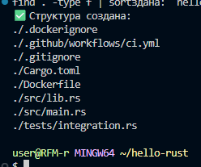
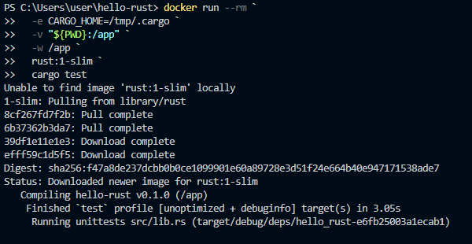
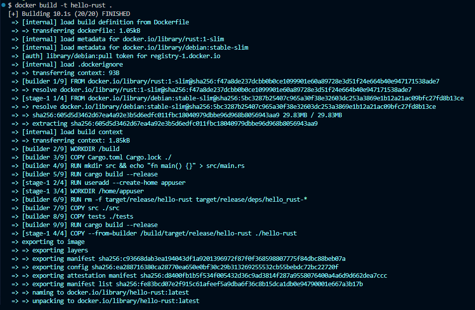
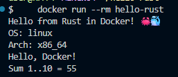
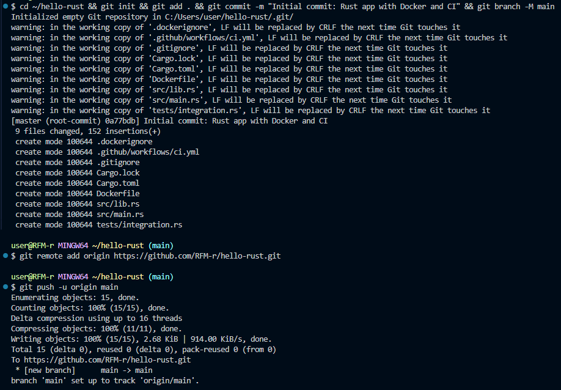
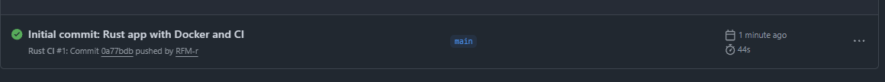
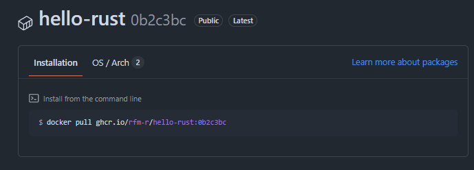

## 1. Создание структуры в корневой домашней папке:

## 2. Сборка проекта и тесты в Docker:

## 3. Сборка Docker-образа (из каталога проекта):

## 4. Запуск контейнера:

## 5. Пуш проекта:

## 6. Коммит в Github Actions:

## 7. Package:
