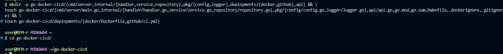
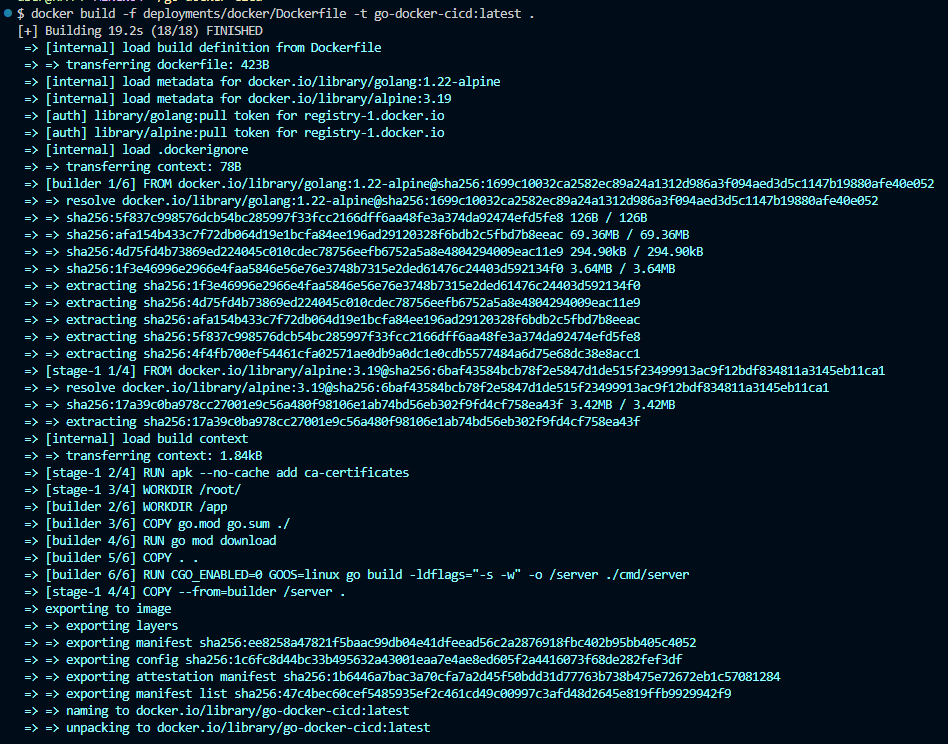
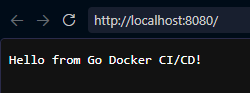
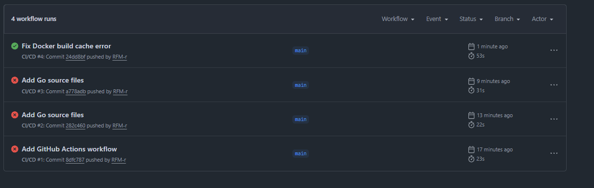
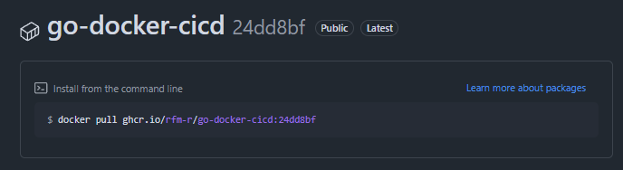

# Самостоятельная работа по DevOps/Pipelines: Go с публикацией в GHCR

## 1. Создание структуры в корневой домашней папке:

## 2. Сборка Docker-образа:

## 3. Проверка сборки локально:

## 4. Коммит в Github Actions:

## 5. Package:

