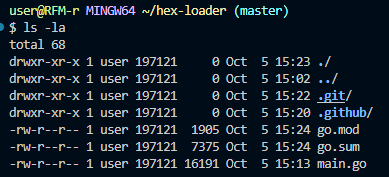
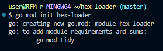
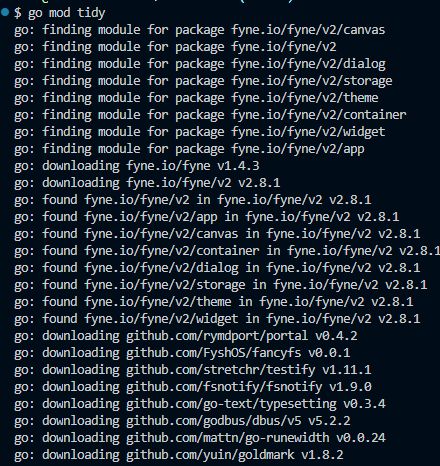
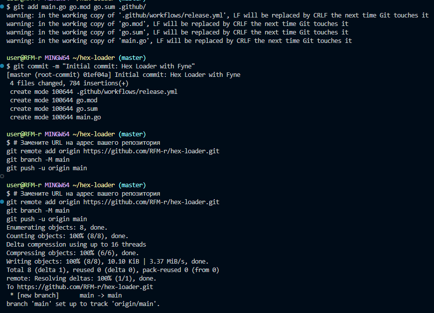
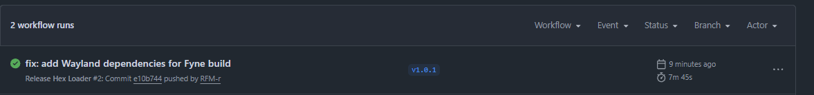
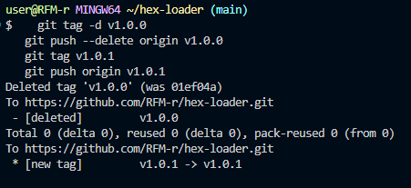
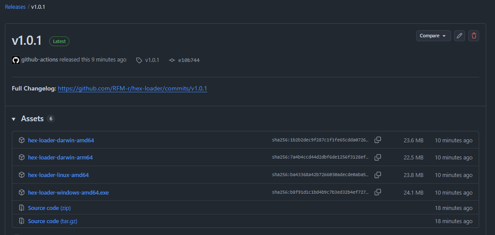
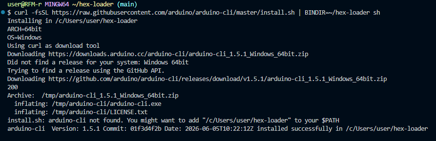
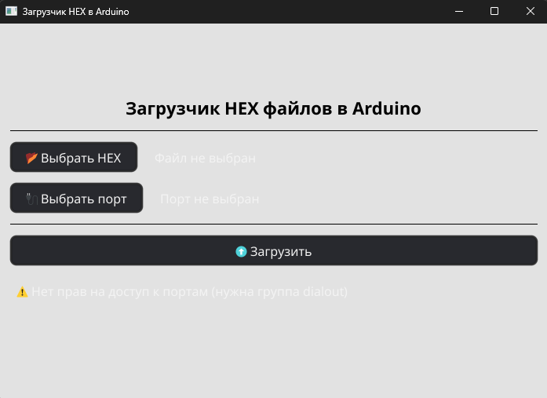

# Самостоятельная работа по DevOps/Pipelines: CI/CD с приложением на Go (Fyne) - Hex Loader + GH Releases

## 1. Структура:

## 2. Подготовка Go модуля и ресурсов:

## 3. Commit и Push проекта в новый репозиторий:

## Ссылка на новый репозиторий: https://github.com/RFM-r/hex-loader

## 4. Commit in Github Actions:

## 5. Создание релиза(GitHub Releases):

# ! Важно ! Иметь установленный Arduino CLI, иначе выдаст ошибку внутри приложения. (Ссылка: https://arduino.github.io/arduino-cli/latest/installation/)
## Установка Arduino CLI:

## 6. Запуск и работа приложения:
